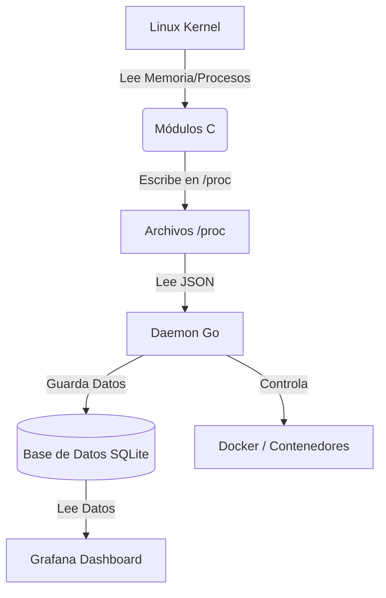

# Manual de Usuario — Proyecto 1 (SO1)

Guía práctica para construir imágenes, compilar módulos de kernel y ejecutar el sistema de monitoreo automatizado con visualización en Grafana.

## Índice

- [Manual de Usuario — Proyecto 1 (SO1)](#manual-de-usuario--proyecto-1-so1)
	- [Índice](#índice)
	- [1. Requisitos Previos](#1-requisitos-previos)
	- [1.1. Arquitectura del Sistema (Diagrama)](#11-arquitectura-del-sistema-diagrama)
	- [2. Instalación y Ejecución](#2-instalación-y-ejecución)
		- [Paso 1: Construir imágenes Docker](#paso-1-construir-imágenes-docker)
		- [Paso 2: Compilar Módulos del Kernel](#paso-2-compilar-módulos-del-kernel)
		- [Paso 3: Iniciar el Daemon (Go)](#paso-3-iniciar-el-daemon-go)
	- [3. Visualización en Grafana](#3-visualización-en-grafana)
		- [Configuración Inicial](#configuración-inicial)
		- [Dashboard A: CONTENEDORES (Consultas)](#dashboard-a-contenedores-consultas)
		- [Dashboard B: SISTEMA (Consultas)](#dashboard-b-sistema-consultas)
	- [4. Solución de Problemas](#4-solución-de-problemas)
	- [5. Limpieza](#5-limpieza)

## 1. Requisitos Previos

- **OS**: Linux (Ubuntu 22.04+ recomendado).
- **Docker**: Instalado y activo.
- **Go**: Versión 1.20 o superior.
- **Herramientas**: `make`, `gcc`, `sqlite3`.

**Instalación rápida de dependencias (Ubuntu/Debian)**:
```bash
# Actualizar y herramientas base
sudo apt update
sudo apt install -y build-essential linux-headers-$(uname -r) golang sqlite3

# Instalar Docker (si no lo tiene)

sudo apt update
sudo apt install -y docker.io docker-compose
sudo usermod -aG docker $USER
newgrp docker
# IMPORTANTE: Cierre sesión y vuelva a entrar para aplicar permisos de Docker
```


## 1.1. Arquitectura del Sistema (Diagrama)

El siguiente diagrama ilustra cómo fluyen los datos desde el núcleo de Linux hasta su pantalla en Grafana:



## 2. Instalación y Ejecución

### Paso 1: Construir imágenes Docker

El sistema necesita 3 imágenes base para generar tráfico. Ejecute desde la carpeta raíz del proyecto:
```bash
cd proyecto-1
docker build -t so1_ram -f bash/docker-files/dockerfile.ram .
docker build -t so1_cpu -f bash/docker-files/dockerfile.cpu .
docker build -t so1_low -f bash/docker-files/dockerfile.low .
```

**Verificación**: Ejecute `docker images | grep so1_` para confirmar.

### Paso 2: Compilar Módulos del Kernel

Antes de iniciar el daemon, debemos compilar los archivos `.c` a objetos de kernel `.ko`.
```bash
cd modulo-kernel
make clean && make
```

Esto generará `sysinfo.ko` y `continfo.ko`.

> **Nota**: No es necesario cargarlos manualmente (`insmod`), el Daemon de Go lo hará automáticamente.

### Paso 3: Iniciar el Daemon (Go)

El daemon es el cerebro del proyecto: carga los módulos, configura el cronjob, levanta Grafana y monitorea el sistema.
```bash
cd ../go-daemon
go mod tidy

# Ejecutar con SUDO (Necesario para insmod y acceso a /proc)
sudo go run main.go
```

**Lo que verás en consola**:

- Cargando módulos del kernel... (Carga `sysinfo` y `continfo`).
- Levantando Grafana... (Inicia contenedor en puerto 3000).
- Configurando Cronjob... (Programa `generator.sh` cada 1 min).
- Logs cada 20s indicando estado de RAM y limpieza de contenedores.

## 3. Visualización en Grafana

### Configuración Inicial

1. Acceda a http://localhost:3000 (Usuario: `admin` / Clave: `admin`).
2. Vaya a **Connections** -> **Add new connection** -> **SQLite**.
3. En **Path**, ingrese: `/var/lib/grafana/metrics.db`.
4. Clic en **Save & Test**.

### Dashboard A: CONTENEDORES (Consultas)

Este dashboard filtra los datos para mostrar solo la actividad de `stress-ng` y `sleep`.

**Total RAM (Stat)**:
```sql
SELECT total FROM ram_log ORDER BY id DESC LIMIT 1;
```

**Free RAM (Stat)**:
```sql
SELECT (total - used) FROM ram_log ORDER BY id DESC LIMIT 1;
```

**Contenedores Eliminados (Time Series)**:
```sql
SELECT timestamp as time, count(id) as value FROM kill_log GROUP BY timestamp ORDER BY timestamp ASC;
```

**Uso de RAM Global (Time Series)**:
```sql
SELECT timestamp as time, used FROM ram_log ORDER BY timestamp ASC;
```

**Top 5 Contenedores RAM (Pie Chart)**:
```sql
SELECT name || ' (' || pid || ')', MAX(ram) FROM process_log WHERE name LIKE 'stress%' OR name = 'sleep' GROUP BY pid, name ORDER BY 2 DESC LIMIT 5;
```

**Top 5 Contenedores CPU (Pie Chart)**:
```sql
SELECT name || ' (' || pid || ')', MAX(cpu) FROM process_log WHERE name LIKE 'stress%' OR name = 'sleep' GROUP BY pid, name ORDER BY 2 DESC LIMIT 5;
```

**RAM Usada (Stat)**:
```sql
SELECT used FROM ram_log ORDER BY id DESC LIMIT 1;
```

**Contenedores Activos (Time Series - Extra)**:
```sql
SELECT timestamp as time, count(distinct pid) FROM process_log WHERE name LIKE 'stress%' OR name = 'sleep' GROUP BY timestamp ORDER BY timestamp ASC;
```

### Dashboard B: SISTEMA (Consultas)

Este dashboard muestra la visión general de todos los procesos del sistema operativo.

**Total RAM (Stat)**: (Igual al anterior).

**Free RAM (Stat)**: (Igual al anterior).

**Total Procesos Contados (Stat)**:
```sql
SELECT count(distinct pid) FROM process_log WHERE timestamp = (SELECT MAX(timestamp) FROM process_log);
```

**Uso de RAM Global (Time Series)**: (Igual al anterior).

**Top 5 Sistema RAM (Pie Chart)**:
```sql
SELECT name || ' (' || pid || ')', MAX(ram) FROM process_log GROUP BY pid, name ORDER BY 2 DESC LIMIT 5;
```

**Top 5 Sistema CPU (Pie Chart)**:
```sql
SELECT name || ' (' || pid || ')', MAX(cpu) FROM process_log GROUP BY pid, name ORDER BY 2 DESC LIMIT 5;
```

**RAM Usada (Stat)**: (Igual al anterior).

**Carga Promedio CPU Sistema (Time Series - Extra)**:
```sql
SELECT timestamp as time, avg(cpu) FROM process_log GROUP BY timestamp ORDER BY timestamp ASC;
```

## 4. Solución de Problemas

**Error: `insmod: ERROR: could not insert module ...: Invalid parameters`**

- **Causa**: Conflicto de permisos al crear `/proc`.
- **Solución**: Asegúrese de que el código C usa permisos `0444` (solo lectura) en `proc_create` y que no hay otro módulo cargado con el mismo nombre. Ejecute `dmesg | tail` para más detalles.

**Error: Grafana no muestra datos ("No data")**

- **Causa**: Permisos de archivo de base de datos o ruta incorrecta.
- **Solución**: Verifique que `go-daemon/metrics.db` tenga permisos de lectura/escritura (`chmod 666 metrics.db`) y que el Data Source en Grafana apunte a `/var/lib/grafana/metrics.db`.

**El script `generator.sh` no se ejecuta automáticamente**

- **Causa**: Ruta incorrecta en el cronjob.
- **Solución**: Revise el log del daemon. Asegúrese de ejecutar `sudo go run main.go` desde dentro de la carpeta `go-daemon` para que pueda resolver la ruta relativa `../bash/generator.sh`.

## 5. Limpieza

Para detener todo y limpiar el sistema:

**Detener Daemon**: Presione `Ctrl + C` en la terminal donde corre Go.

- Esto automáticamente elimina el Cronjob y descarga los módulos.

**Limpiar Contenedores**:
```bash
docker rm -f $(docker ps -aq --filter name=so1_contenedor)
docker rm -f grafana_so1
```

**Limpiar Módulos (si el daemon falló al salir)**:
```bash
sudo rmmod sysinfo
sudo rmmod continfo
```


